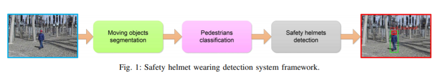
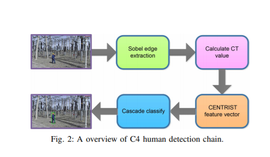
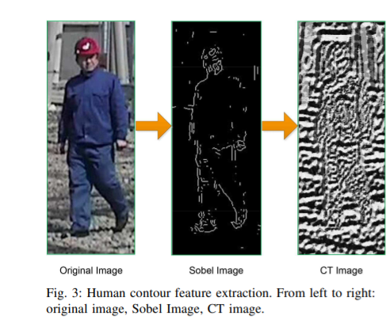
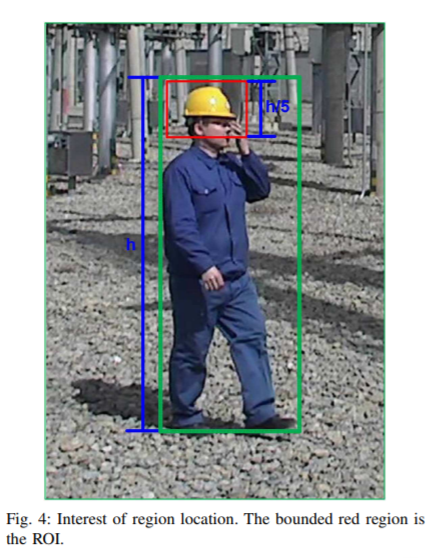
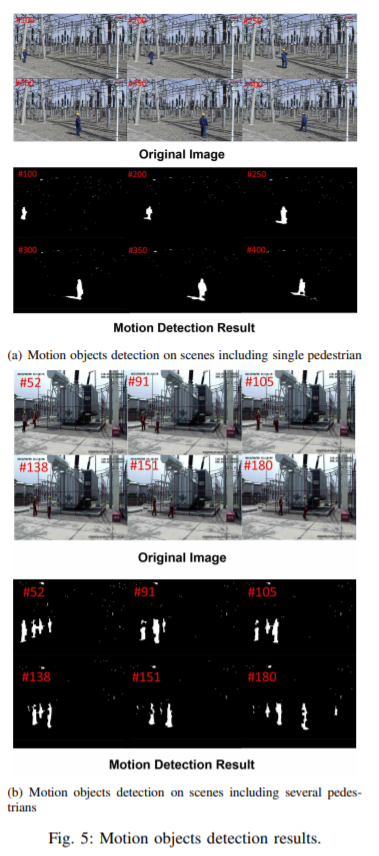
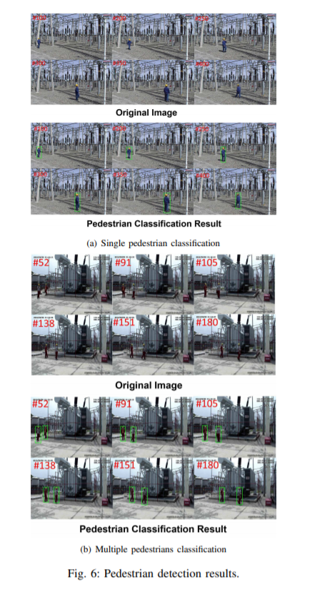
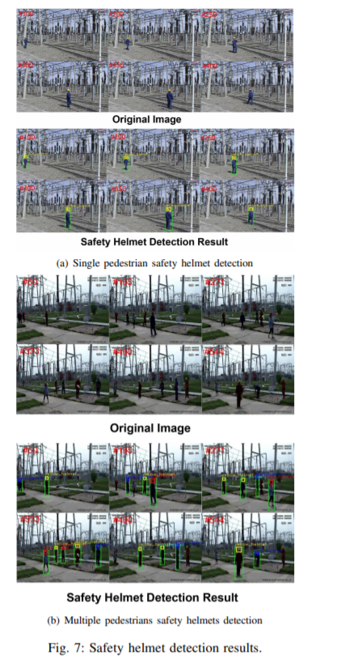
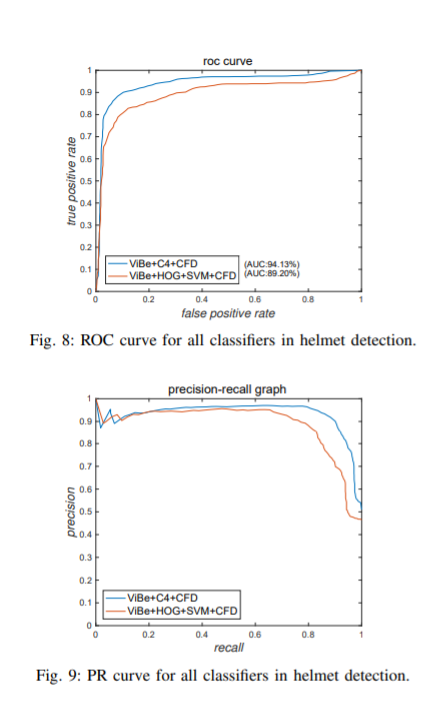

                                  **安全帽佩戴自动检测**    

​                                                              李康，赵晓光，江边，谭敏  

​                                                          复杂系统管理与控制国家重点实验室，           

​                                                               中国科学院自动化研究所，              

​                                                                中国科学院大学，北京              

 邮箱：likang2014@ia.ac.cn，xiaoguang.zhao@ia.ac.cn，bianjiang2015@ia.ac.cn，min.tan@ia.ac.cn              

​        摘要：监督对电力安全至关重要。检测巡视人员是否佩戴安全帽是整个变电站智能监控系统队伍的关键组成部分。本篇论文，提出了一种新颖实用基于计算机视觉、机器学习和图像处理的安全帽检测框架。为了确定变电站内的运动目标，采用了ViBe背景建模算法。而且，基于运动对象分割的结果，在变电站场景中使用实时人体识别框架C4在行人定位中使得处理更加迅速精准。最后，根据对行人检测结果，安全帽佩戴检测是通过头部定位，颜色空间移动与颜色特征识别来实现的。大量的变电站试验结果令人信服，证明了该框架的效力。           

​                                                                         一、导言             

​        众所周知，监视系统是相当重要的，它对变电站安全具有重要意义。在过去的几十年里，一些人工智能技术，如计算机视觉和机器学习在不断地发展，并且取得了很大的成就，如今已经被广泛应用在变电站智能监控中的应用[1]。它不仅可以避免费时费力的工作，而且同时能检测出电力设备故障和工人违章，及时准确地预防事故的发生。              

​        Wang等人，通过使用SIFT特征匹配、Hough变换和KNN算法 [2] 设计了识别变电站隔离开关和断路器的方法。Reddy等人，提出状态监测方案绝缘体。该方案基于KMeans算法得到的感兴趣区域，采用离散正交变换和自适应神经模糊推理相结合的方法 确定绝缘体状况的系统[3]。Chen等人提出了一种有效的自动检测和状态 隔离开关的识别方法，使用有关隔离开关和结合了固定触点的两个重要特点[4]。Liu等人，开发了一种基于图像的状态识别方法： 他们提出用Gabor提取纹理特征              转换，然后隔离器的状态按支持向量机[5]。              

​        上述研究主要集中在电力供应方面设备故障检测与状态识别。除了设备安全，智能监控系统仍需监督操作人员的工作是否安全。巡视人员安全帽佩戴的实时检测作为变电站常见的安全运行情况，是与工人安全有关的相当重要的任务。因此，有必要在变电所开发一个安全帽佩戴自动检测系统。不幸的是相关工作很少，而且大多是在检测摩托车手是否佩戴头盔。Waranusast等人，利用运动目标提取和K近邻（KNN）分类器开发一个能够自动分辨摩托车驾驶员并确定他们是否戴头盔的系统[6]。[7]Silva等人，应用了循环Hough变换与方向梯度直方图利用描述子提取特征，利用多层感知器 用于确定无头盔摩托车手的分类器。有关变电站中安全帽佩戴检测的研究较少。[8]卡尔曼滤波和凸轮位移算法用于跟踪行人和确定运动物体。同时，安全帽的颜色信息是用于检测安全帽的佩戴情况。                     

​        本文的主要目的是开发一个基于计算机视觉，机器学习和图像处理的变电站巡视员安全帽佩戴检测系统 。检测框架的设计目标主要是实现检测变电站的安全巡视人员是否佩戴安全帽，能同时确定安全帽的颜色。为了实现这个目标，采用了ViBe背景建模来跟踪运动物体。此外，C4行人检测算法用于确定运动对象是否为人。最后，这里所做的具体贡献是根据头部位置，颜色空间变换和颜色特征识别检测变电站工作人员是否佩戴安全帽。很明显提出的框架不仅能够准确地实现工人是否戴安全帽的检测，而且理论上，也很适合实际智能监控在变电站中的应用且对硬件依赖性小，运行速度快。           

​       本文的其余部分安排如下，第二节提供了安全帽佩戴检测的总体框架系统。背景建模、行人检测和颜色特征识别方法详见第三节。实验和分析见第四节。最后，第五节总结了结论和今后的工作 。                         

​                                

​                                                   二、 安全帽佩戴检测系统           

​                                                                    框架             

​        图1为本文研究的安全帽佩戴检测系统的原理图。系统被分割为三步：a）运动目标分割；b）行人分类；c）安全帽检测。  

A、 运动目标分割             

​        变电站中运动目标分割的目的是尽可能快地获取运动像素减少搜索感兴趣区域的时间。考虑到固定在变电站的摄像机，背景信息可以作为有价值的先验知识来提取移动目标。直观的想法是每帧与背景图像比较，然后计算确定移动对象的像素距离。由此，我们使用一种快速的背景建模算法visual背景提取器（ViBe）[9]。

B、 行人分类             

​        基于运动目标分割、图像特征提取和行人分类的研究 在变电所将成为安全帽检测的重中之重的任务。行人的分类越精确，安全帽检测就越精确。因此有必要选择一个优秀的特征和一个有效的分类器。本部分探讨的策略是使用C4行人检测算法[10]。在本篇论文中C4算法的唯一区别对C4行人进行分类是集中在运动对象的周围而不是原始帧所有像素上。

C、 安全帽检测       

​        最后一步是安全帽检测。行人分类后，需要确定头部区域。同时，结合色彩空间变换与色彩特征以确定是否巡视人员是否戴安全帽。图像处理技术包括HSV转换[11]和本文采用的自适应阈值选择方法[12]。              

​                                                      三、 系统框架的方法原理           

A、 ViBe：一种通用的背景减法算法             

​        ViBe是一种用于估计背景的像素模型。该算法的实现分为三个步骤：1）模型初始化、 2）前景分割、 3）模型更新。

​        1）模型初始化：模型初始化，作为ViBe算法的第一步，只使用视频的第一帧顺序。与其他背景模型初始化取决于已知的视频的帧数相比，这是一个有吸引力的优点。具体描述如下。              

​        假设Nt（x）是一组N邻域样本在像素x的时间t处的值，nti（x）是这个样本集。可以这样表示第一帧样本集：             

​           N0（x）={n01（x），n02（x），…，N0 N（x）}，i=1，2，…，N       （1）            

​        对于第一帧的每个像素，随机选择一个N0（x）中的值作为像素x的初始值。此模型初始化可以表示为：              

​          B0（x）={v | v∈N0（x）}                                                                             （2）             

​        其中B0（x）是像素x的初始背景模型，v表示像素值。             

​       2） 前景分割：假设SR（nti（x））是以nti（x）为中心的半径R球体，可通过比较样本之间的nti（x）与其相邻值来设置Nt（x）。然后计算此球体与样本集Nt（x）的集合交集，记作：

​          #{SR（nti（x））∩Nt（x）}                                                                          （3）            

​        此外，如果#min小于平均基数，则将#min表示为背景的固定阈值建模。              

​        3） 模型更新：前台检测后，ViBe算法采用保守的更新方案。首先，背景像素具有1/β更新的可能性。而且，区别于每帧更新的方法，只有一定的1/β可能更新当前帧。最后，允许每个像素在相邻像素之间扩散像素，随机选择自己的样本集进行更新。

​                                     

B、 C4：一个实时的人体检测框架             

​        C4是基于CENTRIST，通过目标物体轮廓线索进行检测的实时精准的人类检测算法。特征提取与人体检测链研究综述如图2所示。该方法显示了轮廓信息对于行人检测尤其重要。因此，它使用Sobel边缘检测[13]和人口普查转换（CT）[14]对行人的轮廓进行编码。之后，C4算法通过将图像分割成块并合并相邻块成为单元格，将位置信息集成到特征向量中。最后，采用了串级分类器线性支持向量机与直方图相交核（HIK）SVM[15] 用于确定人类或非人类。更多细节如下所示。                     

​         1） 特征提取：如图3所示，从运动前景中寻找人体物体的明显特征，首先计算每个像素的Sobel梯度。然后定义一个大小为8bit的变量Census Transform，用于计算编码比较的符号。如等式4所示，比较一个像素值和它的八个相邻像素，如果中心像素大于其中一个像素，则位设置为1否则设置为0。8位可以在任意排序中收集并转换为CT值，范围从0到255。           

 32  64  96                     1   1    0  

 32  64  96         ⇒         1         0    ⇒  （11010110）2⇒CT=214 

 32  32  96                      1   1   0                                                                                （4）      

​        为了引入空间分布信息中心特征向量，C4算法分割图像修补成9×6块并将任何相邻的2×2块作为超级块。提取单元是一个超级块，因此有24个超级区块。最后的特征向量是256×24=6144尺寸。                

​        2）行人分类：探测器在自举方式下训练。在训练阶段，我们准备了一套正训练图像补丁P与一组非人类负面图像N。第一步是随机选择从N到形成负的子集的负补片的一部分样本N1。利用P和N1，我们训练了一个支持向量机分类器H1。然后，H1用于搜索硬示例，这些硬示例示例被添加到N1中以形成新的负集H2。利用P和N2对支持向量机分类器H2进行训练。这个一个循环处理直到设定时间结束，最后训练的线性支持向量机 将达到高频。              

​        在这里，行人分类器是一个由线性支持向量机和HIK支持向量机组成的级联分类器。线性分类器第一个分类器，实现快速对人的粗略判断。而HIK-SVM分类器在CENTRIST上准确检测人体起着更重要的作用。             

C、 颜色特征鉴别              

​        假设行人分类完全满足使用C4，安全帽检测可以充分利用行人位置信息。如图4所示，我们感兴趣的是边界框中五分之一的顶部区域即头部位置的区域。这个值是根据经验选择的。在使用头盔最重要的颜色信息确定人是否戴安全帽，颜色空间实现了变换和颜色特征识别。因为HSV颜色空间中的图像对颜色的适应性更强分割，所以我们把RGB转换成HSV。值得注意的是设置色调和饱和度通道的固定阈值可以分割各种颜色，然后用或区分人有没有安全帽。而我们只设置色调通道阈值，不定义饱和通道阈值。相反，我们在饱和通道上使用OSTU方法自动获取阈值和分段颜色。   

​                           

​                                                              四、 结果和讨论              

A、 实验装置              

​        为了评估提议的安全帽检测框架，对监控录像进行了广泛的实验，具有挑战性背景的单行人和多行人的变电站序列，包括电线、电线杆、栏杆等。固定观看和运行的10个不同场景的视频，我们的检测算法。值得注意的是，所提出的方法适合检测巡视员是否佩戴安全帽，因为安全巡逻是变电站最常见的情况。因此，十个录像都是巡视性的。

​        在这里，我们在佩戴安全帽时标记了数据禁止戴安全帽。行人分类的准确度定义为Accpd=T/ T+F，其中T表示正确分类结果的数目行人，F表示行人的错误分类结果的数量。此外，基于准确的行人分类，接收器工作特性（ROC）曲线，并绘制了安全帽佩戴检测系统的精确召回（PR）曲线说明该系统具有良好的性能。          

B、 实验结果与分析              

​        背景建模是安全帽的第一步磨损检测。如图5（a）和（b）所示，由单个行人和将多个行人分别分割。白色的像素是运动的前场，黑色像素是静态的，是背景。运动目标检测结果令人满意。 在行人检测方面，我们使用INRIA人数据集[16]和从变电站收集到列车分类器的行人数据。图6（a）和（b）显示了分类包括单个行人在内的现场行人结果以及多个行人。该分级机的表现适用于复杂变电站背景。              

​        最后，安全帽佩戴检测结果为如图7（a）和（b）所示。单人的安全帽可以很好地检测到，但多个行人安全帽有时可能检测不到。在我们看来考试不及格的主要原因是目标距离监控摄像头较远。C4行人分类不能在太少的目标上工作。同时，C4对行人的描述能力是有局限性的，这也会导致检测数据不合格。另外，有两个错误的原因检测：一是行人检测的错误。例如太大或太小的边界框，可能导致头部位置错误。另一个是安全帽对光照变化敏感。所以这两点是有较大的改良空间。            

​        除了定性分析，定量分析是需要对所提方法的性能进行评估。这10个视频中行人分类Accpd的平均精度约为84.2%。图8和图9分别表示变电站中不同方法对应的ROC曲线和PR曲线。我们可以看到结合C4分类器和颜色特征的算法的ViBe表现区分（CFD）优于使用HOG特征提取，支持向量机（SVM）以及颜色特征识别（CFD）ViBe算法组合。ROC曲线的AUC指数用于确定不同的分类器。使用SVM分类器的，HOG特征提取方法的AUC为89.20% ，使用我们方法的AUC为94.13%。提高了5%左右。              

​       总之，无论是定性分析还是定量分析，该方法在一定程度上实现了准确的检测巡视人员是否佩戴安全帽。

C、 讨论              

​        这项工作对安全监督很有意义，因为巡视检查在变电站和佩戴安全帽的确定对巡视人员的安全至关重要。为了解放工人，采用计算机视觉和机器学习算法以完成此检测任务。ViBe背景算法缩小了巡查人员的搜索范围。C4算法快速实现了行人分类。颜色特征判别法（CFD）确定安全帽佩戴         情况。总体框架对于完成这个任务来说是非常快速准确的。

​        然而，也存在一些具有挑战性的问题。举个例子，C4行人分类方法固定参数下的颜色特征识别不适用于各种环境，如天气更改，就需要修改不同场景中的参数。             

​                                                                                 五、 结论           

​        在这篇论文中，我们开发了一个新颖实用的安全帽佩戴检测系统，确定巡视人员是否佩戴安全帽。ViBe背景建模算法实现了良好的运动目标检测效果。此外，C4行人分类算法实现了工人位置的快速定位。这个提出的安全帽检测框架的关键步骤是HSV颜色空间中的颜色特征识别，这一算法在变电站的场景下表现很出色。大量的实验结果表明了该探测系统的安全帽佩戴的准确性和效率。                   

​        当前和今后的工作重点是安全帽在行人多、背景复杂的场景中进行佩戴检测，探索研究更精确的特征设计和更稳健的检测方法。             

​                                                                                      致谢              

​        这项工作部分得到了国家自然科学的支持，中国基金会拨款61271432和61421004，部分由国家电网公司支持。